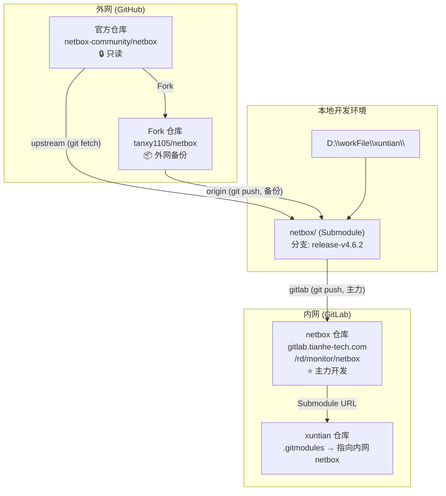
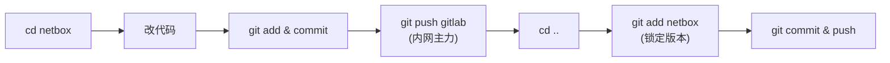
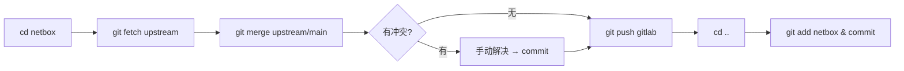
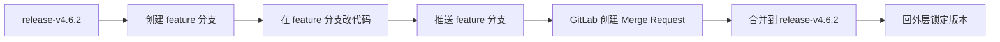

# Netbox Submodule 工作流指南

本项目通过 **Fork + Submodule + 内网 GitLab** 方式管理 Netbox 源码，允许自由修改代码的同时跟踪官方更新。

---

## 代码架构图



### 仓库关系一览

| 仓库 | 地址 | 角色 |
|------|------|------|
| 官方 netbox | `github.com/netbox-community/netbox` | 上游源码，只拉不推 |
| Fork netbox | `github.com/tanxy1105/netbox` | 外网备份，可选推送 |
| 内网 netbox | `gitlab.tianhe-tech.com/rd/monitor/netbox` | **主力开发仓库** |
| 内网 xuntian | GitLab 外层项目 | 通过 `.gitmodules` 引用 netbox |

---

## Remote 配置

| 名称 | 地址 | 用途 |
|------|------|------|
| `gitlab` | `https://gitlab.tianhe-tech.com/rd/monitor/netbox.git` | ⭐ 内网主力，日常推送 |
| `origin` | `https://github.com/tanxy1105/netbox.git` | 📦 外网备份（可选） |
| `upstream` | `https://github.com/netbox-community/netbox.git` | 🔄 拉取官方更新 |

验证配置：
```powershell
cd netbox
git remote -v
```

---

## 分支策略

| 分支 | 来源 | 用途 |
|------|------|------|
| `main` | 跟踪 `upstream/main` | 官方开发主线 |
| `release-v4.6.2` ⭐ | 基于 `v4.6.2` tag 创建 | **当前工作分支**，存放自定义修改 |

---

## 初始化（新成员）

```powershell
# 从内网 GitLab 克隆项目（含子模块）
git clone --recurse-submodules <xuntian GitLab 地址>

# 如果已经克隆但子模块为空
git submodule update --init --recursive
```

---

## 日常操作

### 1. 修改代码并提交



```powershell
# Step 1: 进入子模块
cd netbox

# Step 2: 修改代码...

# Step 3: 提交并推送到内网 GitLab（必须）
git add .
git commit -m "描述你的修改内容"
git push gitlab release-v4.6.2

# Step 4: (可选) 同步到 GitHub 备份
git push origin release-v4.6.2

# Step 5: 回到外层仓库，锁定新版本（必须）
cd ..
git add netbox
git commit -m "更新 netbox 子模块：描述你的修改"
git push
```

> ⚠️ **关键**：Step 3 推代码，Step 5 锁版本。两步缺一不可，否则别人拉不到你的修改。

### 2. 同步官方最新代码



```powershell
# Step 1: 进入子模块
cd netbox

# Step 2: 拉取官方最新并合并
git fetch upstream
git merge upstream/main

# Step 3: 如有冲突，手动解决后提交
git add .
git commit -m "合并上游更新"

# Step 4: 推送到内网 GitLab
git push gitlab release-v4.6.2

# Step 5: (可选) 同步到 GitHub 备份
git push origin release-v4.6.2

# Step 6: 回外层锁定版本
cd ..
git add netbox
git commit -m "同步 netbox 上游最新版本"
git push
```

### 3. 查看当前版本

```powershell
git submodule status
# 输出示例: 912bb22... netbox (v4.3.4-1317-g912bb22a1)
```

---

## 分支管理

### 查看远程分支

```powershell
cd netbox

# 查看所有远程分支（包括 upstream 和 gitlab）
git branch -r

# 只看 gitlab 远程分支
git ls-remote --heads gitlab

# 在 PowerShell 中过滤 gitlab 分支
git branch -r | Select-String "gitlab"
```

### 切换到其他官方分支

```powershell
cd netbox

# 查看所有远程分支
git branch -r

# 基于官方某分支创建本地分支
git checkout -b <本地分支名> upstream/<远程分支名>
```

### 切换到其他 Release 版本

```powershell
cd netbox

# 查看所有可用 tag
git tag -l 'v4.*'

# 基于 tag 创建分支
git checkout v4.5.0
git switch -c release-v4.5.0
```

### 将 main 合并到当前工作分支

```powershell
cd netbox
git checkout release-v4.6.2
git fetch upstream
git merge upstream/main

# 解决冲突后
git add .
git commit -m "合并 upstream/main 到 release-v4.6.2"
git push gitlab release-v4.6.2

# 回外层锁定
cd ..
git add netbox
git commit -m "更新 netbox：合并 upstream/main"
```

> ⚠️ main 与 release 版本差异大，合并可能产生大量冲突。如只需某个功能，建议用 `git cherry-pick <commit-SHA>`。

### Feature 分支工作流（推荐）

通过创建 feature 分支开发，再合并到 `release-v4.6.2`，保持主分支稳定。



**方式一：通过 GitLab Merge Request（推荐）**

```powershell
cd netbox

# 1. 确保在 release-v4.6.2 且是最新
git checkout release-v4.6.2
git pull gitlab release-v4.6.2

# 2. 基于 release-v4.6.2 创建 feature 分支
git checkout -b feature/your-feature-name

# 3. 修改代码...

# 4. 提交并推送到 GitLab
git add .
git commit -m "描述你的修改"
git push gitlab feature/your-feature-name

# 5. 去 GitLab 网页创建 Merge Request
#    source: feature/your-feature-name → target: release-v4.6.2

# 6. MR 合并后，切回 release-v4.6.2 拉取最新
git checkout release-v4.6.2
git pull gitlab release-v4.6.2

# 7. 删除本地 feature 分支（可选）
git branch -d feature/your-feature-name

# 8. 回外层锁定版本
cd ..
git add netbox
git commit -m "更新 netbox 子模块：合并 feature/xxx"
```

**方式二：本地直接合并**

```powershell
cd netbox

# 1. 创建并切换到 feature 分支
git checkout -b feature/your-feature-name

# 2. 修改代码并提交
git add .
git commit -m "描述你的修改"

# 3. 切回 release-v4.6.2 并合并
git checkout release-v4.6.2
git merge feature/your-feature-name

# 4. 推送到 GitLab
git push gitlab release-v4.6.2

# 5. 删除 feature 分支
git branch -d feature/your-feature-name

# 6. 回外层锁定版本
cd ..
git add netbox
git commit -m "更新 netbox 子模块：合并 feature/xxx"
```

---

## 常见问题

### Q: 忘记在外层 `git add netbox` 会怎样？
A: 其他人拉取外层仓库后，子模块仍指向旧 commit，看不到你的最新修改。

### Q: 合并上游时冲突怎么办？
A: 手动解决冲突 → `git add .` → `git commit` → `git push gitlab release-v4.6.2` → 回外层锁定版本。

### Q: 如何回退子模块到历史版本？
```powershell
cd netbox
git checkout <commit-SHA>
cd ..
git add netbox
git commit -m "回退 netbox 到指定版本"
```

### Q: `detached HEAD` 是什么？
A: 直接 checkout 一个 tag（如 `git checkout v4.6.2`）时，HEAD 指向具体 commit 而非分支。此时提交的代码切走就丢。必须用 `git switch -c <分支名>` 创建分支来保留修改。

### Q: 内网 GitLab 认证失败？
A: GitLab 禁用了密码认证，需要使用 Personal Access Token：
1. GitLab → Settings → Access Tokens → 勾选 `write_repository`
2. 推送时用户名填 `oauth2`，密码填 Token
